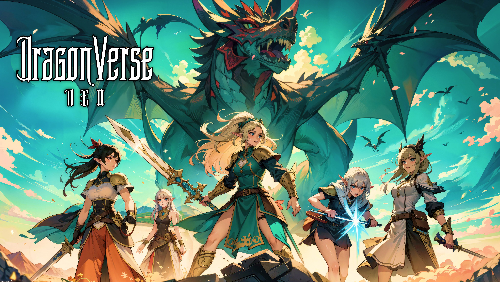
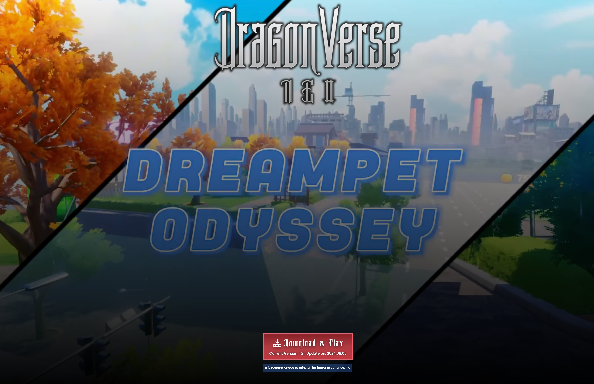
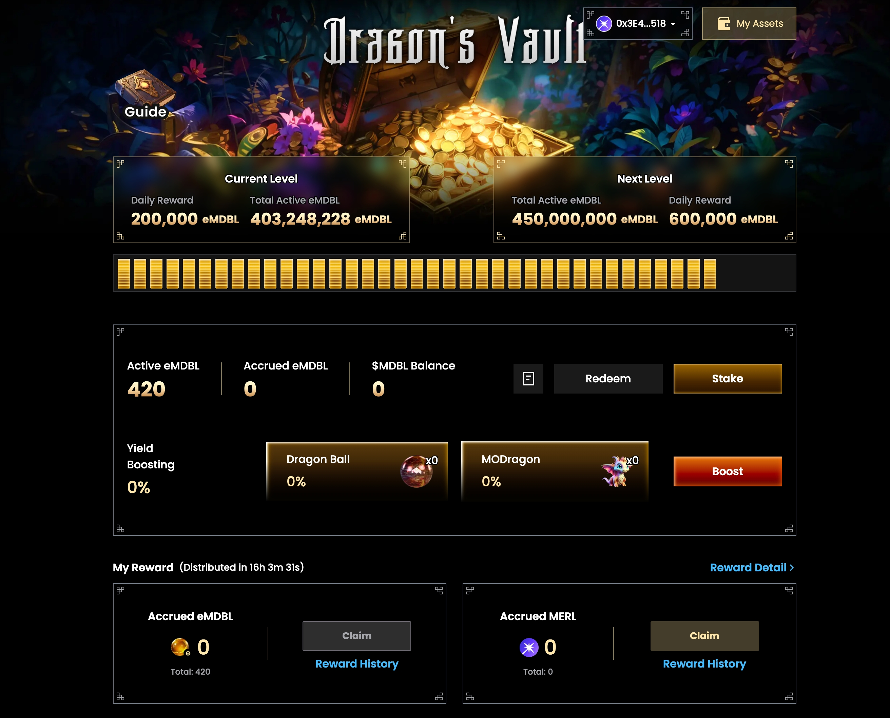
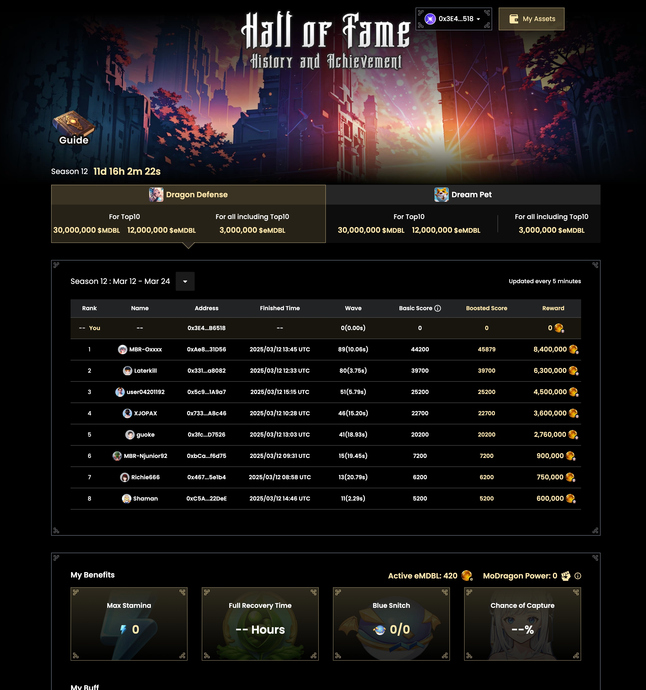
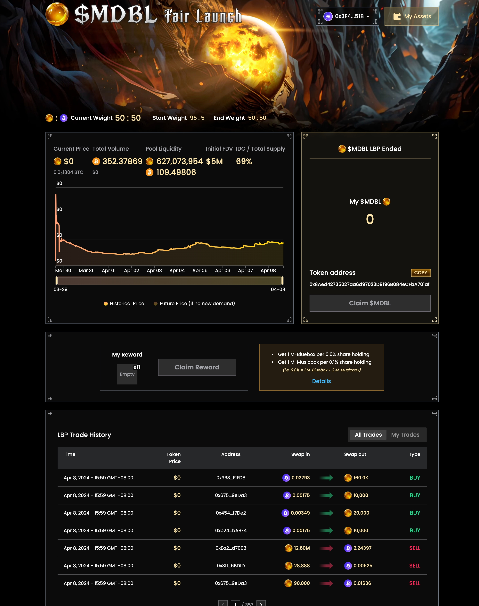

## Dragonverse Mobox

This is a website for the Dragonverse game, where users can connect their wallets to view their game resources and the leaderboards for each game.



## 🎮 Game Features

- Web3 Integration with Wallet Connect support
- PGE Download and Play
- Stake and earn
- Game Rank and Reward
- LBP Airdrop
- LitePaper

## 🛠 Technology Stack

- **React**: A JavaScript library for building user interfaces.
- **Next.js**: A React framework for server-side rendering and static site generation.
- **Tailwind CSS**: A utility-first CSS framework for styling.
- **LESS**: A CSS pre-processor for additional styling capabilities.
- **Axios**: A promise-based HTTP client for making requests.
- **Framer Motion**: A library for animations.
- **React Toastify**: A library for notifications.
- **Recharts**: A charting library for React.
- **Swiper**: A modern mobile touch slider.

### Blockchain Integration

- **Web3.js**: A library for interacting with the Ethereum blockchain.
- **TronWeb**: A library for interacting with the TRON blockchain.
- **Ethers.js**: A library for interacting with the Ethereum blockchain.
- **Wagmi**: A collection of React hooks for Ethereum.
- **SIWE**: Sign-In with Ethereum.
- **Wallet Connect**: A protocol for connecting decentralized applications to mobile wallets.

### State Management

- **Jotai**: A primitive and flexible state management library for React.
- **React Query**: A library for fetching, caching, and updating asynchronous data in React.

### Utilities

- **Day.js**: A lightweight JavaScript date library.
- **Lodash**: A modern JavaScript utility library.
- **LocalForage**: A library for offline storage.
- **JWT Decode**: A library for decoding JSON Web Tokens (JWT).

### Development Tools

- **TypeScript**: A typed superset of JavaScript.
- **ESLint**: A tool for identifying and reporting on patterns in JavaScript.
- **Prettier**: An opinionated code formatter.
- **Tailwind CSS**: A utility-first CSS framework.
- **PostCSS**: A tool for transforming CSS with JavaScript plugins.
- **SVGR**: A tool for transforming SVGs into React components.
- **Pino Pretty**: A pretty printer for Pino log output.

## Website Content

### Download PGE



### Stake



### Rank



### LBP



## Getting Started

First, run the development server:

```bash
npm run dev
# or
yarn dev
# or
pnpm dev
# or
bun dev
```

Open [http://localhost:3000](http://localhost:3000) with your browser to see the result.

You can start editing the page by modifying `app/page.tsx`. The page auto-updates as you edit the file.

This project uses [`next/font`](https://nextjs.org/docs/basic-features/font-optimization) to automatically optimize and load Inter, a custom Google Font.

## Learn More

To learn more about Next.js, take a look at the following resources:

- [Next.js Documentation](https://nextjs.org/docs) - learn about Next.js features and API.
- [Learn Next.js](https://nextjs.org/learn) - an interactive Next.js tutorial.

You can check out [the Next.js GitHub repository](https://github.com/vercel/next.js/) - your feedback and contributions are welcome!

## Deploy on Vercel

The easiest way to deploy your Next.js app is to use the [Vercel Platform](https://vercel.com/new?utm_medium=default-template&filter=next.js&utm_source=create-next-app&utm_campaign=create-next-app-readme) from the creators of Next.js.

Check out our [Next.js deployment documentation](https://nextjs.org/docs/deployment) for more details.